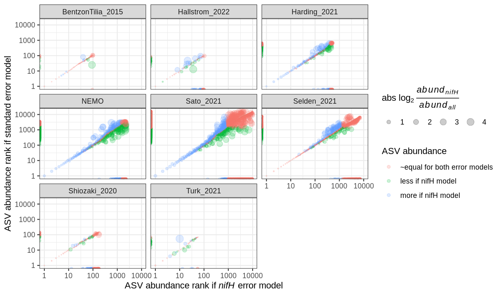

# Effects of using error models trained only on _nifH_ reads

To evaluate the impact of using error models that were trained only on _nifH_-like reads, we ran
eight _nifH_ amplicon data sets through the pipeline twice, with _nifH_ error models and with
standard error models that used all reads.

The first plot shows the percentage of reads in each sequencing run that were *gained* by using
_nifH_ error models.  Gains are shown at each stage of the pipeline from ASV inference ("Denoise")
through bimera removal, as well as after subsequent filtering for ASVs with lengths expected to
capture _nifH_ (280 - 360 nt).  Gains were usually small and occurred during ASV inference.  For
NEMO and Harding_2021 the median gains were > 3%.

The following plot compares ASVs found when the pipeline was run with vs. without _nifH_ error
models.  Axes indicate ASV rank abundances (#1 is the most abundant).  Mostly the same ASVs were
found using either error model, indicated by points which are not on the axes.  Using either error
model, the top ~100 ASVs usually had identical ranks (ASVs on _y_ = _x_) and very similar abundances
(log ratio ~1).  However, for rarer ASVs the ranks and abundances differed between the two error
models.  Moreover, using standard models resulted in more total ASVs, usually a few hundred to a few
thousand per study. This is evident by the greater number of ASVs found that were unique to the
standard model (on the _y_ axis) compared to ASVs unique to the _nifH_ model (on the _x_ axis).  The
fewer ASVs under the _nifH_ model were despite the gains in total reads used (first plot).

